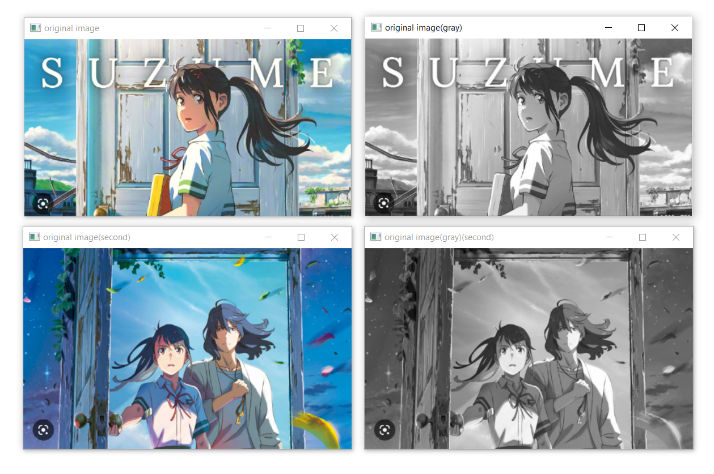
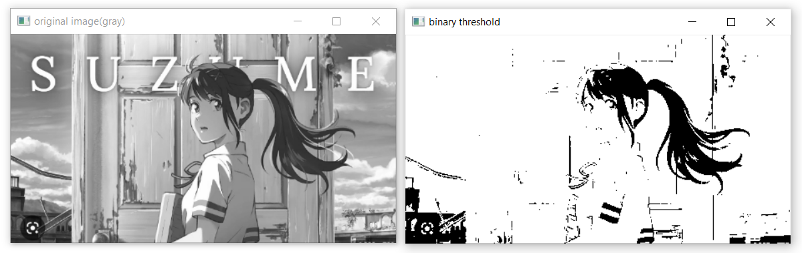
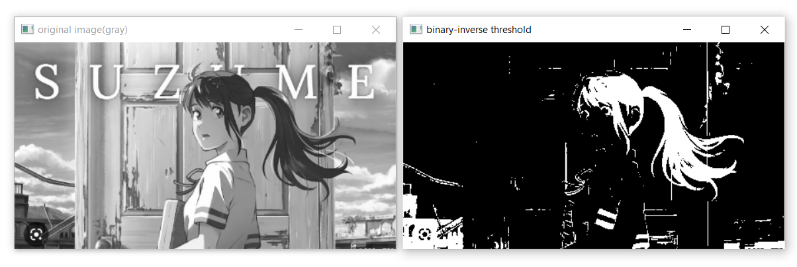
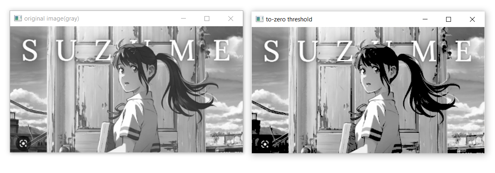
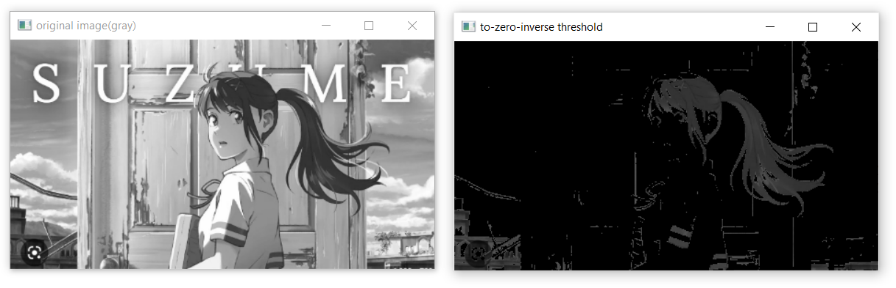
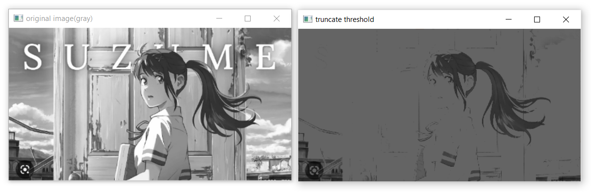
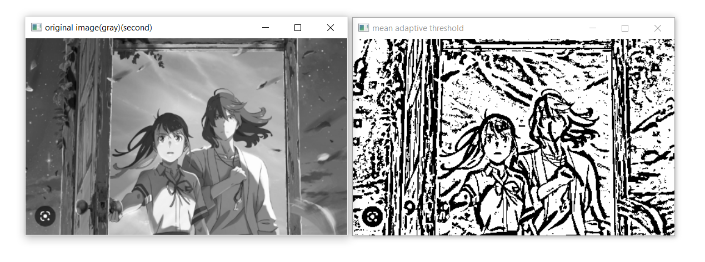
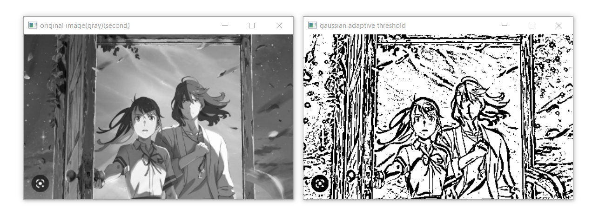
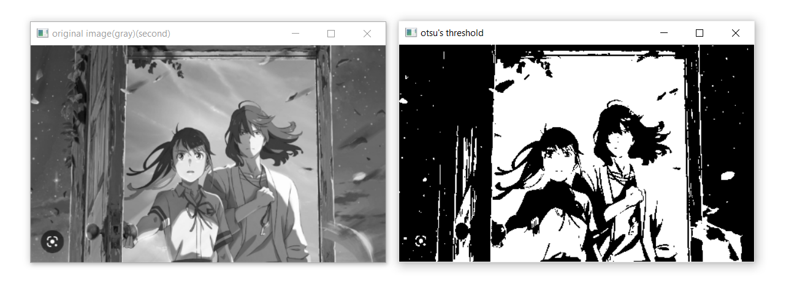

# Thresholding of Images
## Aim
To segment the image using global thresholding, adaptive thresholding and Otsu's thresholding using python and OpenCV.

## Software Required
1. Anaconda - Python 3.7
2. OpenCV

## Algorithm

### Step1:
Load the necessary packages.
<br>

### Step2:
Read the Image and convert to grayscale.
<br>

### Step3:
Use Global thresholding to segment the image.
<br>

### Step4:
Use Adaptive thresholding to segment the image.
<br>

### Step5:
Use Otsu's method to segment the image.
<br>

### Step 6:
Display the results.
<br>
## Program

```python
#program by: Kaushika A
#reg no: 21221230048
```
<br>

### Load the necessary packages
```python
import cv2
import numpy as np
import matplotlib.pyplot as plt
```

### Read the Image and convert to grayscale
```python
in_img=cv2.imread('suzume.PNG')
in_img2=cv2.imread('suzume2.PNG')

in_img= cv2.resize(in_img, (461,250))
in_img2= cv2.resize(in_img2, (463,284))

gray_img = cv2.cvtColor(in_img,cv2.COLOR_BGR2GRAY)
gray_img2 = cv2.cvtColor(in_img2,cv2.COLOR_BGR2GRAY)
```
<br>

### Use Global thresholding to segment the image
```python
# cv2.threshold(image, threshold_value, max_val, thresholding_technique)
ret,thresh_img1=cv2.threshold(gray_img,86,255,cv2.THRESH_BINARY)
ret,thresh_img2=cv2.threshold(gray_img,86,255,cv2.THRESH_BINARY_INV)
ret,thresh_img3=cv2.threshold(gray_img,86,255,cv2.THRESH_TOZERO)
ret,thresh_img4=cv2.threshold(gray_img,86,255,cv2.THRESH_TOZERO_INV)
ret,thresh_img5=cv2.threshold(gray_img,100,255,cv2.THRESH_TRUNC)
```
<br>

### Use Adaptive thresholding to segment the image
```python
# cv2.adaptiveThreshold(source, max_val, adaptive_method, threshold_type, blocksize, constant)
thresh_img6=cv2.adaptiveThreshold(gray_img2,255,cv2.ADAPTIVE_THRESH_MEAN_C,cv2.THRESH_BINARY,11,2)
thresh_img7=cv2.adaptiveThreshold(gray_img2,255,cv2.ADAPTIVE_THRESH_GAUSSIAN_C,cv2.THRESH_BINARY,11,2)
```
<br>

### Use Otsu's method to segment the image 
```python
# cv2.threshold(img,0,255,cv2.THRESH_BINARY+cv2.THRESH_OTSU)
ret,thresh_img8=cv2.threshold(gray_img2,0,255,cv2.THRESH_BINARY+cv2.THRESH_OTSU)
```
<br>

### Display the results
```python
cv2.imshow('original image',in_img)
cv2.imshow('original image(second)',in_img2)

cv2.imshow('original image(gray)',gray_img)
cv2.imshow('original image(gray)(second)',gray_img2)

cv2.imshow('binary threshold',thresh_img1)
cv2.imshow('binary-inverse threshold',thresh_img2)
cv2.imshow('to-zero threshold',thresh_img3)
cv2.imshow('to-zero-inverse threshold',thresh_img4)
cv2.imshow('truncate threshold',thresh_img5)

cv2.imshow('mean adaptive threshold',thresh_img6)
cv2.imshow('gaussian adaptive threshold',thresh_img7)

cv2.imshow('otsu\'s threshold',thresh_img8)

cv2.waitKey(0)
cv2.destroyAllWindows()
```

<br>

## Output

### Original Image

<br>

### Global Thresholding

<br>

<br>

<br>

<br>

<br>

### Adaptive Thresholding

<br>

<br>


### Optimum Global Thesholding using Otsu's Method

<br>
<br>
<br>
<br>

## Result
Thus the images are segmented using global thresholding, adaptive thresholding and optimum global thresholding using python and OpenCV.

